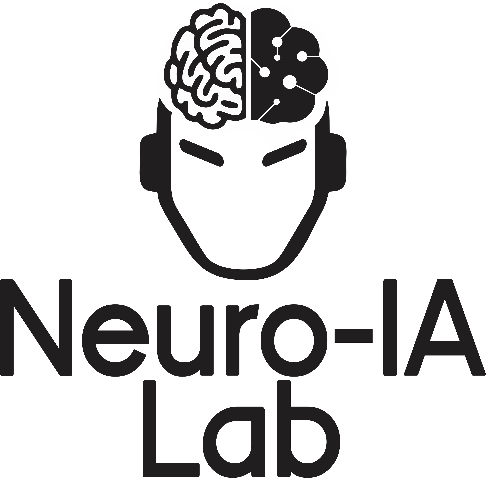

# Material para taller *Hands-on EEG: introducción a la simulación, procesamiento y análisis de EEG con Python*

## IMPORTANTE

Este repositorio es un material complementario para el taller *Hands-on EEG: introducción a la simulación, procesamiento y análisis de EEG con Python* a dictarse el día 14 de octubre de 2025 en el XXV congreso Argentino de Bioingeniería de la Sociedad Argentina de Bioingeniería.

El autor es **[BALDEZZARI LUCAS](https://www.linkedin.com/in/lucasbaldezzari/)**, profesor Adjunto de la carrera de Ingeniería Biomédica de la [Universidad Tecnológica (UTEC)](https://utec.edu.uy/es/) del Uruguay, investigador del Laboratorio de Neurociencias e Inteligencia Artificial aplicada de la UTEC, y este material es de uso libre y gratuito para fines educativos.

La conformación de este material ha llevado tiempo, esfuerzo y dedicación, **por lo que se solicita respetar la autoría del mismo y si se utiliza, citar la fuente.**